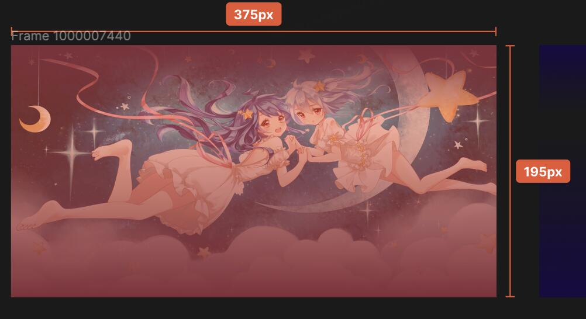
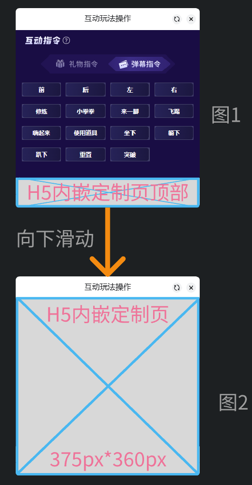
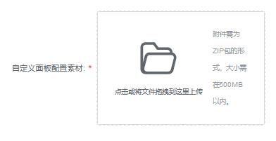

> 官方文档快照 · [在线原文](https://open-live.bilibili.com/document/bf5e438f-3bce-3c8c-3bd4-e9526ace16ec) · 抓取时间：2026-09-17T18:35:12.779127+00:00

# 自定义互动面板

<font color=Red>注意</font>
该页面为高级合作功能，如需申请合作，请发送邮件申请：<live-open@bilibili.com>

## 前端规范

#### Iframe安全级别

参考文档：https://www.bookstack.cn/read/html-tutorial/spilt.2.docs-iframe.md

目前开放的级别：

```json
sandbox="allow-scripts allow-forms"
```

请开发者在服务端下发html资源时，配置如下响应头（key-value）：
```
Cross-Origin-Embedder-Policy：require-corp
```

响应头详情可参考[MDN文档说明](https://developer.mozilla.org/zh-CN/docs/Web/HTTP/Headers/Cross-Origin-Embedder-Policy)

#### 操作限制

- 由于Iframe本身嵌入到直播间页面或app中，为兼容性考虑，请勿在页面中添加**滑动**功能（上下左右滑动均都请勿设置）。
- 如需翻页相关功能，请使用“按钮”进行翻页。

## 配置步骤
**入口路径: 我的项目 / 项目详情 / 互动面板**

## 封面图

说明：为玩法指令tab打开后，用户进入前默认展示的封面图

尺寸：375px * 195px


## 自定义页面

说明：内嵌内容为厂商提供的url链接内容，容器内支持点击操作功能
尺寸：375px * 360px

默认打开时显示范围入图1所示，往下滑动到最底下时为图2样式
- 图1展示的定制页顶部用于提示用户示意可向下滑动




### 自定义面板链接配置

面板中使用的配置链接


### 主视觉图片

上传图片，用于显示在自定义面板入口背景图片


### 自定义面板配置素材

提交自定义面板页面内容相关图片素材压缩包。

