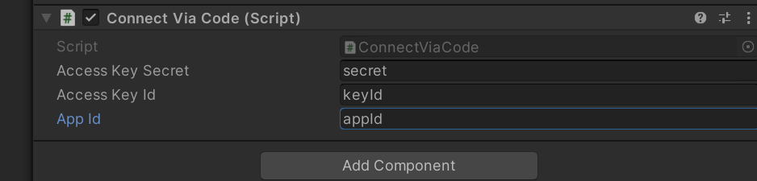
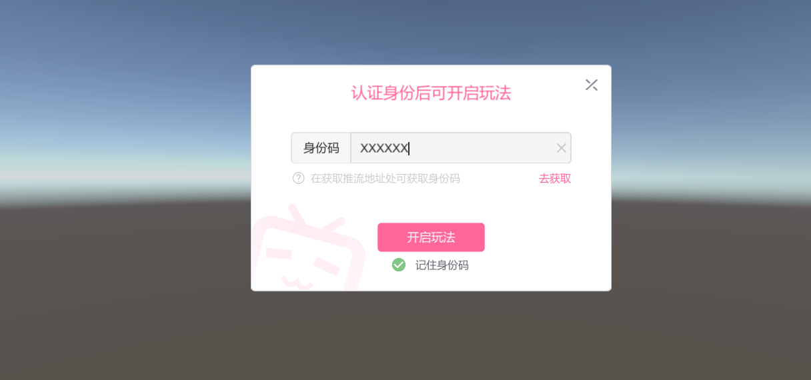

> 官方文档快照 · [在线原文](https://open-live.bilibili.com/document/cca272c5-e49d-6bea-0fbe-23c37288a08a) · 抓取时间：2026-09-17T18:35:12.779127+00:00

# OpenBLive
## 说明 
本项目为直播创作者服务中心`Unity`版Demo案例，用于验证签名以及基础ws示例。  

本SDK实现为基础功能，更多高级功能以及使用请自行探索，以及根据具体的业务功能和需求自行修改（例如重连、心跳等）

开放平台相关文档请访问：[哔哩哔哩互动玩法接入文档](eba8e2e1-847d-e908-2e5c-7a1ec7d9266f.md)

## 项目地址
[Github](https://github.com/bilibili-openplatform/OpenLive_UnityDemo)

## 环境要求
`Unity 2020.x`或更高版本

## Dependencies

[Newtonsoft Json Unity Package  ](https://docs.unity3d.com/Packages/com.unity.nuget.newtonsoft-json@2.0/manual/index.html)

## 使用范围
本签名示例的覆盖范围为[直播创作者服务中心](bdb1a8e5-a675-5bfe-41a9-7a7163f75dbf.md#h1-u5E73u53F0u4ECBu7ECD)中相关接口的签名实现，不包含[哔哩哔哩开放平台文档中心](https://open.bilibili.com/doc)中的相关接口，请注意。

## 快速开始

打开`../OpenBLive/Samples/ConnectViaCode`场景，在场景中的`ConnectViaCode`脚本中填入您的key与secret以及对应的项目Id。



填写后运行_Demo中的示例开启游戏




## 直播姬启动传参
``` 
start.exe -room_id=XXX  code=XXXX  
```